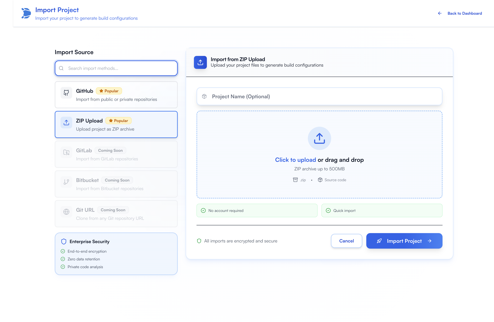
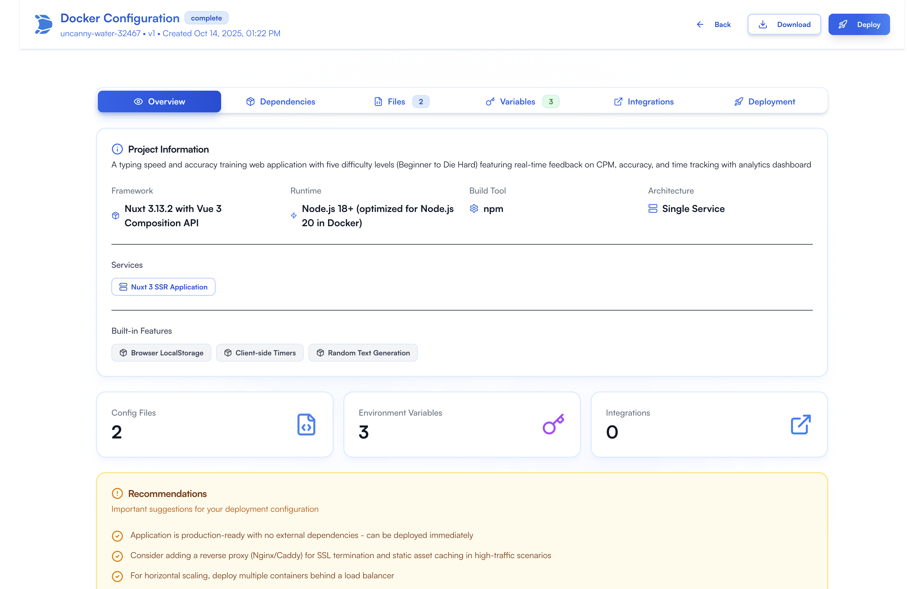
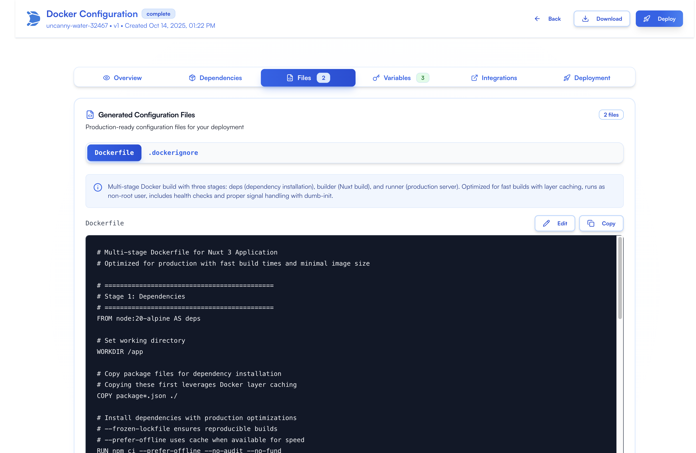
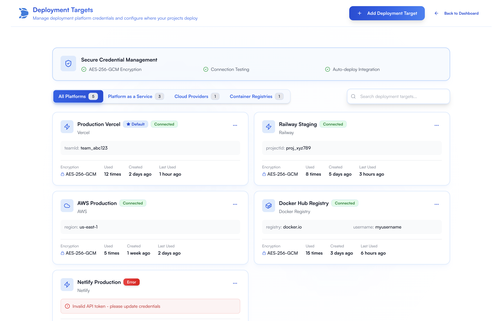

 <div align="center">

<picture>
  <source media="(prefers-color-scheme: dark)" srcset="documentation/assets/logos/logo-dark.jpg">
  <source media="(prefers-color-scheme: light)" srcset="documentation/assets/logos/logo.jpg">
  
</picture>

# DXLander

**Your Intelligent Self-Hosted Deployment Suite**

Skip the configuration hassle. Import any project, get deployment-ready instantly.

> ⚠️ **HEAVY DEVELOPMENT** - This project is in active development. Expect breaking changes, incomplete features, and evolving APIs. Contributions welcome but use in production at your own risk.

[](LICENSE)
[](https://github.com/dxlander/dxlander/actions/workflows/ci.yml)
[](CONTRIBUTING.md)
[](https://www.typescriptlang.org/)
[](https://nextjs.org/)
[](#current-status)

[Features](#key-features) • [Quick Start](#quick-start) • [Documentation](#documentation) • [Contributing](#contributing)

</div>

---

## What is DXLander?

DXLander is a **self-hosted platform** that lets you test and deploy any project without the configuration headache. Import a repo or upload a project, and DXLander automatically detects frameworks, analyzes dependencies, generates deployment configs (Docker, K8s, etc.), and can deploy to your preferred platform or service all out of the box.

- **Exploring random GitHub projects** - Test and deploy any project in minutes
- **Zero-configuration deployment** - From import to production automatically
- **Self-managed control** - Your infrastructure, your data, your rules
- **AI-powered intelligence** - Smart framework detection and optimal config generation

---

## Screenshots

### Project Import & Management

<div align="center">

<p><em>Multiple import methods: GitHub, ZIP upload, GitLab, Bitbucket with drag-and-drop support</em></p>
</div>

### AI-Powered Project Discovery

<div align="center">

<p><em>Intelligent framework detection and discovered features</em></p>
</div>

### Configuration Generation

<div align="center">

<p><em>Generated production-ready Docker configurations with multi-stage builds, syntax highlighting, and deployment recommendations</em></p>
</div>

### Deployment Targets

<div align="center">

<p><em>Manage deployment platforms</em></p>
</div>

---

## Key Features

### Project Import & Management

- **Multiple Import Methods**:
  - GitHub repositories (public & private with PAT)
  - ZIP file upload with drag & drop
  - GitLab/Bitbucket (coming soon)
- **Duplicate Detection**: SHA256 hashing prevents re-importing same project
- **Real-time Dashboard**: Status-based filtering, search, and organization

### AI-Powered Project Discovery

- **Framework Detection**: Next.js, React, Vue, Python, Go, and more
- **Dependency Analysis**: Reads package.json, requirements.txt, Cargo.toml, etc.
- **Environment Variable Detection**: Scans for required API keys and configurations
- **Build Command Inference**: Generates appropriate build and start commands
- **Real-time Progress Tracking**: Watch AI analyze your project in real-time

### Build Configuration Management

- **Multiple Configuration Types**:
  - Docker (single container deployments)
  - Docker Compose (multi-service applications)
  - Kubernetes (production-grade orchestration)
  - Bash scripts (deployment automation)
- **Configuration Editor**: Edit, version, and manage generated configs
- **Visual File Viewer**: Tabbed interface with syntax highlighting
- **Change Detection**: Track modifications with reset-to-original capability
- **Version History**: Track all configuration versions over time

### Integration & Security

- **Secure Credential Storage**: AES-256-GCM encrypted storage.
- **JWT Authentication**: Secure API access with token-based auth
- **Role-Based Access Control**: Admin and user roles
- **Per-User Encryption Keys**: Individual security per user account

---

## Technology Stack

### Frontend

- **Next.js 15** with App Router + **React 19**
- **TailwindCSS v4**
- **shadcn/ui** components (ocean-themed)
- **tRPC** for end-to-end type safety

### Backend

- **Hono**
- **Node.js 18+**
- **tRPC**

### Infrastructure

- **Storage**: Local file system (`~/.dxlander/projects/`)
- **Package Manager**: pnpm workspaces

---

## Quick Start

### Prerequisites

- **Node.js 18+** (for npm/source installation)
- **pnpm** (for development)
- **Docker** (optional, for containerized deployment)

### Installation Options

#### Option 1: NPM

```bash
# Run directly without installation
npx dxlander

# Or install globally
npm install -g dxlander
dxlander
```

#### Option 2: Docker

```bash
# Pull and run the latest version
docker pull ghcr.io/dxlander/dxlander:latest
docker run -d \
  -p 3000:3000 \
  -p 3001:3001 \
  -v dxlander-data:/app/.dxlander \
  --name dxlander \
  ghcr.io/dxlander/dxlander:latest

# Access at http://localhost:3000
```

**Data Persistence**

Your data is automatically stored in the `dxlander-data` volume:

- Database: `/app/.dxlander/data/dxlander.db`
- Projects: `/app/.dxlander/projects/`
- Encryption keys: `/app/.dxlander/encryption.key`

**Useful Commands**

```bash
# View logs
docker logs -f dxlander

# Stop the container
docker stop dxlander

# Restart the container
docker restart dxlander

# Remove the container
docker rm -f dxlander

# Backup your data
docker run --rm -v dxlander-data:/data -v $(pwd):/backup alpine \
  tar czf /backup/dxlander-backup.tar.gz -C /data .
```

### Development Setup

```bash
# 1. Clone repository
git clone https://github.com/dxlander/dxlander.git
cd dxlander

# 2. Install dependencies
pnpm install

# 3. Start development servers
pnpm dev

# Frontend: http://localhost:3000
# Backend: http://localhost:3001
# Database: ~/.dxlander/data/dxlander.db
```

### First-Time Setup

On first launch, you'll see the **Setup Wizard**:

1. **Welcome** - Introduction to DXLander
2. **Admin Account** - Create your first admin user
3. **Quick Start** - Click "Use Defaults" for instant setup:
   - Email: `admin@dxlander.local`
   - Password: `admin123456`
   - SQLite database configured
   - Ready in seconds!

---

## Available Scripts

### Development

```bash
pnpm dev              # Start both frontend and backend
pnpm dev:web          # Start only frontend (Next.js)
pnpm dev:api          # Start only backend (Hono)
```

### Building

```bash
pnpm build            # Build all packages and apps
pnpm build:web        # Build frontend only
pnpm build:api        # Build backend only
```

### Testing & Quality

```bash
pnpm lint             # Lint all code
pnpm lint:fix         # Auto-fix linting issues
pnpm format           # Format code with Prettier
pnpm format:check     # Check formatting
pnpm typecheck        # TypeScript type checking
pnpm test             # Run tests
```

---

### Quick Links

- [Setup Guide](#quick-start)
- [Docker Deployment](documentation/DOCKER.md)
- [Architecture](#technology-stack)
- [Contributing](CONTRIBUTING.md)

---

## 🤝 Contributing

DXLander is open-source and welcomes contributions!

### Development Workflow

1. **Fork** the repository
2. **Create** a feature branch (`git checkout -b feature/amazing-feature`)
3. **Make** your changes following our code quality standards
4. **Test** your changes (`pnpm test`)
5. **Lint** and format (`pnpm lint:fix && pnpm format`)
6. **Commit** your changes (pre-commit hooks will run automatically)
7. **Push** to the branch (`git push origin feature/amazing-feature`)
8. **Open** a Pull Request using our PR template

All PRs must pass automated checks:

- ✅ ESLint (no errors or warnings)
- ✅ Prettier (code properly formatted)
- ✅ TypeScript (no type errors)
- ✅ Tests (all tests passing)
- ✅ Build (successful build)

See our [Development Workflow Guide](documentation/DEVELOPMENT_WORKFLOW.md) for details.

---

## 📄 License

MIT License - see [LICENSE](LICENSE) file for details.

This means you can:

- Use commercially
- Modify
- Distribute
- Use privately
- Sublicense

---

## Supported Platforms & Integrations

### Import Sources (Current)

- **GitHub** (public & private repositories)
- **ZIP uploads** (drag & drop support)
- Coming Soon: **GitLab**
- Coming Soon: **Bitbucket**
- Coming Soon: **Git URL** (generic Git repositories)

### Deployment Platforms (Planned)

- **Vercel** - Serverless deployments
- **Railway** - Full-stack applications
- **Netlify** - Static sites & functions
- **Docker** - Local & remote containers
- **Fly.io** - Global edge deployments
- **Render** - Web services & databases
- **Others**

---

## Quick Commands Summary

```bash
# NPM - Try DXLander instantly
npx dxlander

# Docker - Run in container
docker run -p 3000:3000 -p 3001:3001 ghcr.io/dxlander/dxlander:latest

# Docker Compose - Full setup
docker compose up -d

# Development
pnpm install && pnpm dev

# Build for production
pnpm build

# Type checking
pnpm typecheck

# Linting
pnpm lint
```

---

## Community & Support

### Get Help

- **Documentation**: Check `/documentation` folder
- **Discussions**: GitHub Discussions
- **Bug Reports**: GitHub Issues
- **Feature Requests**: GitHub Issues

### Stay Updated

- **Star** the repository
- **Watch** for releases
- **Follow** for updates

---

## 🤝 Contributing

DXLander is open source and welcomes contributions! This project is in heavy development, so there are many opportunities to contribute.

### Ways to Contribute

- **Bug Reports**: Found an issue? Open a GitHub issue
- **Feature Requests**: Have an idea? Submit a GitHub issue with your suggestion
- **Documentation**: Help improve our docs
- **Testing**: Test the application and report issues
- **Code**: Submit pull requests for bug fixes or new features

### Development Status

Check the [Features Overview](documentation/FEATURES_OVERVIEW.md) for what's complete and what's in progress.

### Getting Started

1. Fork the repository
2. Clone your fork: `git clone https://github.com/your-username/dxlander.git`
3. Follow the [development setup instructions](documentation/GETTING_STARTED.md)
4. Create a feature branch: `git checkout -b feature-name`
5. Make your changes and test thoroughly
6. Submit a pull request

### Code of Conduct

Please be respectful and constructive in all interactions

---

## 📄 License

MIT License - see [LICENSE](LICENSE) for details.

---

[Contributing](#-contributing) • [License](#-license)

</div>
